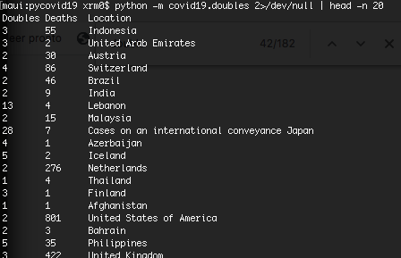
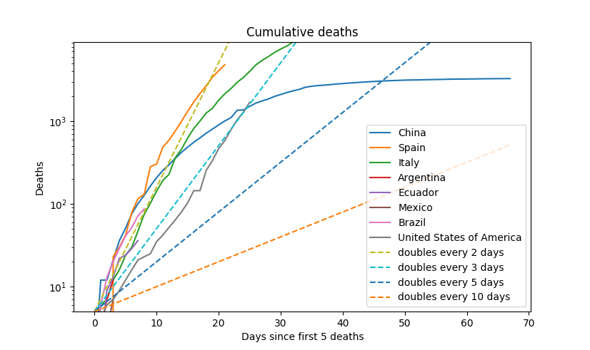

# About

The script makes some graphs on covid19 cases using data from the [European Centre for Disease Prevention and control](https://www.ecdc.europa.eu/en/publications-data/download-todays-data-geographic-distribution-covid-19-cases-worldwide)

## How to run the scripts

Each script creates a graphic:

Confirmed cases:
``python -m covid19.confirmed_cases``

How long did it take for the number of total confirmed deaths to double? (copied the idea from [ourworldindata](https://ourworldindata.org/coronavirus):
``python -m covid19.doubles``

Growth rate of cases:
``python -m covid19.growth_rate``

**DISCLAIMER**: I'm no statistician, data scientist, epidemiologist, nor I have any knowledge on viruses. I just have some free time and I'm playing around with the dataset and matplotlib, the graphs might not be accurate and/or have errors.

